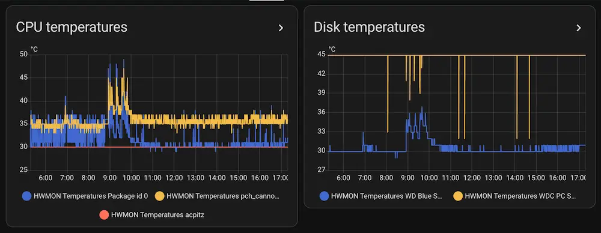

# HWMON Temperatures

[](https://github.com/DigitallyRefined/ha-hwmon_temp/actions/workflows/hassfest.yaml)
[](https://github.com/DigitallyRefined/ha-hwmon_temp/actions/workflows/hacs_action.yml)
[](https://github.com/custom-components/hacs)


Monitor hardware temperatures from `/sys/class/hwmon` in Home Assistant. This integration provides real-time temperature monitoring for various hardware components including CPUs, storage devices, and other temperature sensors accessible through the Linux hardware monitoring subsystem.

## Features

- **Automatic Discovery**: Automatically detects and monitors all available temperature sensors
- **Real-time Updates**: Configurable polling intervals for temperature readings
- **Device Classification**: Intelligent naming and categorization of temperature sensors
- **Multiple Device Support**: Monitors various hardware components simultaneously

## Supported Devices

This integration can monitor temperatures from various hardware components including:

- **CPU Temperature Sensors**
  - Intel Core processors (via `coretemp` module)
  - AMD processors (via `k10temp` module)
  - ARM processors (via thermal zones)
- **Storage Devices**
  - NVMe SSDs (via `nvme` module)
  - SATA SSDs and HDDs (via `drivetemp` module)
  - SMART-enabled drives
- **Motherboard Sensors**
  - Various motherboard temperature sensors
  - System temperature monitoring
- **Other Hardware**
  - GPU temperature sensors (when available via hwmon)
  - Custom temperature sensors

## Prerequisites

### Linux Kernel Modules

To use this integration, you need to ensure the appropriate Linux kernel modules are loaded for your hardware. The required modules depend on your specific hardware: see [HWMON Setup](#hwmon-setup)

## Installation

### HACS (recommended)

If you dont' have [HACS](https://hacs.xyz) installed yet, I highly recommend it.  

[](https://my.home-assistant.io/redirect/hacs_repository/?owner=DigitallyRefined&repository=ha-hwmon_temp&category=integration)  
Or search for `HWMON Temperatures` in HACS or copy this GitHub URL and add it as a custom integration repository.

### Manual installation

[Download the latest `hwmon_temp.zip` release](https://github.com/DigitallyRefined/ha-hwmon_temp/releases) and extract it into your `<config>/custom_component` folder.

## Configuration

After installation you need to **restart** Home Assistant before using this integration.

[](https://my.home-assistant.io/redirect/config_flow_start/?domain=hwmon_temp)  

Or

1. Go to **Settings** → **Devices & Services**
2. Click **Add Integration**
3. Search for "HWMON Temperatures"
4. Click on the integration
5. Configure the update interval (default: 30 seconds)
6. Click **Submit**

### Configuration Options

- **Update Interval**: How often to poll for temperature updates (in seconds)
  - Minimum: 10 seconds
  - Recommended: 30-60 seconds
  - Default: 30 seconds

## Usage

### Available Sensors

Once configured, the integration will automatically create temperature sensors for each detected hardware component. Sensor names are automatically generated based on the hardware type:

- **CPU sensors**: `Core 0`, `Core 1`, `Package`, etc.
- **Storage devices**: Device model names (e.g., `Samsung SSD 970 EVO Plus`)
- **Motherboard sensors**: Component names (e.g., `System`, `CPU`, `Motherboard`)

### Dashboard Integration

Add temperature sensors to your Home Assistant dashboard:

```yaml
type: history-graph
title: CPU temperatures
entities:
  - entity: sensor.dev_cpu_package_id_...
  - entity: sensor.dev_cpu_pch_...
  - entity: sensor.dev_cpu_acpitz
hours_to_show: 12
```

```yaml
type: history-graph
title: Disk temperatures
entities:
  - entity: sensor.dev_nvme0_...
  - entity: sensor.dev_nvme1_...
hours_to_show: 12
```



### Automations

You can create automations based on temperature thresholds:

```yaml
# Example automation for high CPU temperature
automation:
  - alias: "High CPU Temperature Alert"
    trigger:
      platform: numeric_state
      entity_id: sensor.core_0_temperature
      above: 80
    action:
      - service: notify.mobile_app
        data:
          message: "CPU temperature is high: {{ states('sensor.core_0_temperature') }}°C"
```

## Troubleshooting

### No Temperature Sensors Found

**Note** this may not work correctly if you're running Home Assistant inside of a virtual machine, unless `/sys/class/hwmon/` is specifically shared from host machine to the guest machine.

1. **Check kernel modules**:

   ```bash
   lsmod | grep -E "(coretemp|k10temp|nvme|drivetemp)"
   ```

2. **Verify hwmon directory**:

   ```bash
   ls -la /sys/class/hwmon/
   ```

3. **Check permissions**:

   ```bash
   ls -la /sys/class/hwmon/hwmon*/temp*_input
   ```

### Permission Denied Errors

If you encounter permission issues, ensure the Home Assistant process has read access to `/sys/class/hwmon/`:

```bash
# Check Home Assistant user
ps aux | grep homeassistant

# Verify file permissions
ls -la /sys/class/hwmon/
```

### Missing Specific Hardware

If specific hardware isn't detected:

1. **Load required kernel modules** (see [HWMON Setup](#hwmon-setup))
2. **Run sensors-detect**:

   ```bash
   sudo sensors-detect
   ```

3. **Check hardware compatibility** with your Linux distribution

### HWMON Setup

### CPU Temperature Monitoring

```bash
# For Intel processors
sudo modprobe coretemp

# For AMD processors
sudo modprobe k10temp

# For ARM processors (usually built-in)
# No additional module needed
```

#### Storage Device Temperature Monitoring

```bash
# For NVMe drives
sudo modprobe nvme

# For SATA drives with temperature support
sudo modprobe drivetemp

# For SMART-enabled drives
sudo modprobe smart
```

#### Motherboard Sensors

```bash
# Common motherboard sensor modules
sudo modprobe lm_sensors
sudo modprobe it87
sudo modprobe k8temp
sudo modprobe fam15h_power
```

#### Verifying Hardware Support

Check if your hardware is detected:

```bash
# List all hwmon devices
ls -la /sys/class/hwmon/

# Check specific hwmon device details
cat /sys/class/hwmon/hwmon*/name

# List temperature sensors
find /sys/class/hwmon -name "temp*_input"
```
